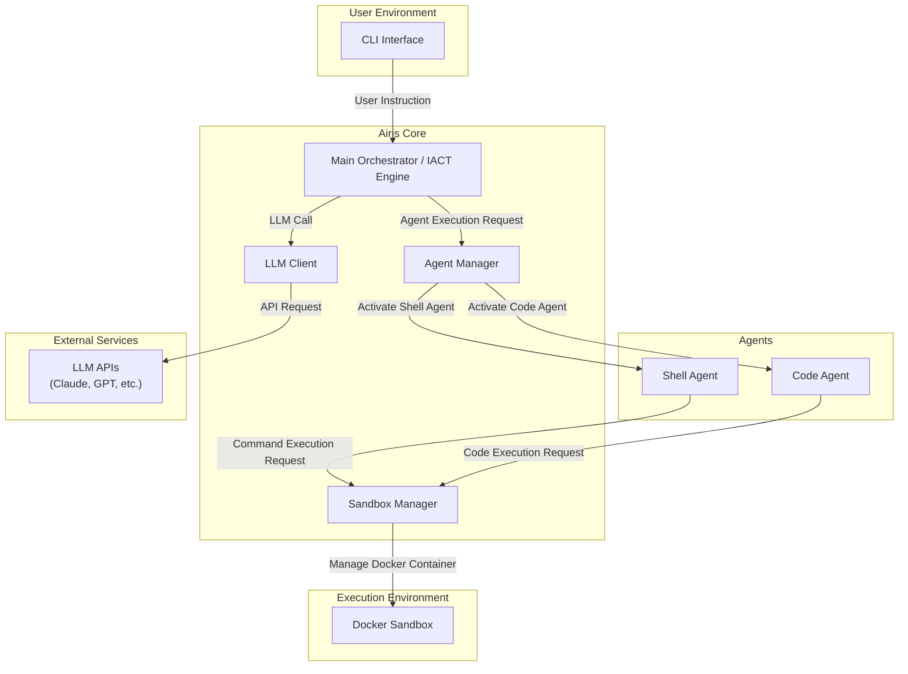

# `Airis` MVP システム設計書 v1.1

| 項目 | 内容 |
| --- | --- |
| **ドキュメントバージョン** | 1.1 |
| **作成日** | 2025年10月11日 |
| **更新日** | 2025年10月12日 |
| **対象フェーズ** | MVP (Minimum Viable Product) |
| **目的** | 要件定義で定められた機能を、どのようなアーキテクチャと技術で実現するかを定義する。 |

---

## 1. システムアーキテクチャ

`Airis`は、以下の主要コンポーネントが連携して動作するモジュール構成を取る。

### 1.1. アーキテクチャ図

### 1.2. コンポーネントの役割

* **CLI Interface**: ユーザーからの対話を受け付け、`Main Orchestrator`に指示を渡すエントリーポイント。
* **Main Orchestrator (IACT Engine)**: ユーザーの指示を解釈し、タスクの分解・計画を行う中核部分。LLMと連携し、エージェントの呼び出し順序などを決定する。
* **Agent Manager**: `Main Orchestrator`の指示に基づき、適切な専門エージェント（`Code Agent`など）を動的に選択・実行する。
* **Specialist Agents (`Code Agent`, `Shell Agent`)**: コード生成やシェルコマンド実行など、特定のタスクに特化した機能を持つモジュール。
* **LLM Client**: 外部のLLM APIとの通信を抽象化し、リクエストの送信とレスポンスの受信を管理する。
* **Sandbox Manager**: エージェントからの依頼に基づき、安全なDockerコンテナの作成、その中でのコマンド実行、完了後の破棄といったライフサイクルを管理する。
  - **Docker統合:** `docker-compose`を利用して`Airis`自体をコンテナとして実行し、その`Airis`コンテナ内からさらに子コンテナ（サンドボックス）を起動するネストされたDocker環境を構築。
  - **ボリュームマウント:** ホスト側のプロジェクトルートディレクトリを`HOST_PROJECT_DIR`環境変数で`Airis`コンテナに渡し、子コンテナへのバインドマウントの`source`パスとして利用することで、ホストのファイルシステムとの連携を可能にする。

---

## 2. 技術スタック

上記のアーキテクチャを実現するため、Pythonエコシステムを中心に以下の技術を選定する。

| カテゴリ | 技術名 | 選定理由 |
| --- | --- | --- |
| **プログラミング言語** | **Python 3.11+** | AI/MLライブラリが豊富で、非同期処理などの現代的な開発機能が充実しているため。 |
| **CLIフレームワーク** | **Typer** | 型ヒントに基づいた直感的なCLI構築が可能で、開発効率が高い。 |
| **AI/Agentフレームワーク** | **LangChain** | LLMとの連携、エージェント、ツール、プロンプト管理など、`Airis`の中核機能開発を強力にサポートするため。 |
| **Docker連携** | **Docker SDK for Python** | PythonからDocker Engine APIを直接操作するための公式ライブラリであり、安定性と機能性が高いため。 |
| **設定ファイル管理** | **PyYAML** | 人間が読み書きしやすい`config.yaml`を安全かつ容易に扱うための標準的なライブラリであるため。 |
| **環境変数管理** | **python-dotenv** | `.env`ファイルから環境変数を安全かつ容易に読み込むため。 |