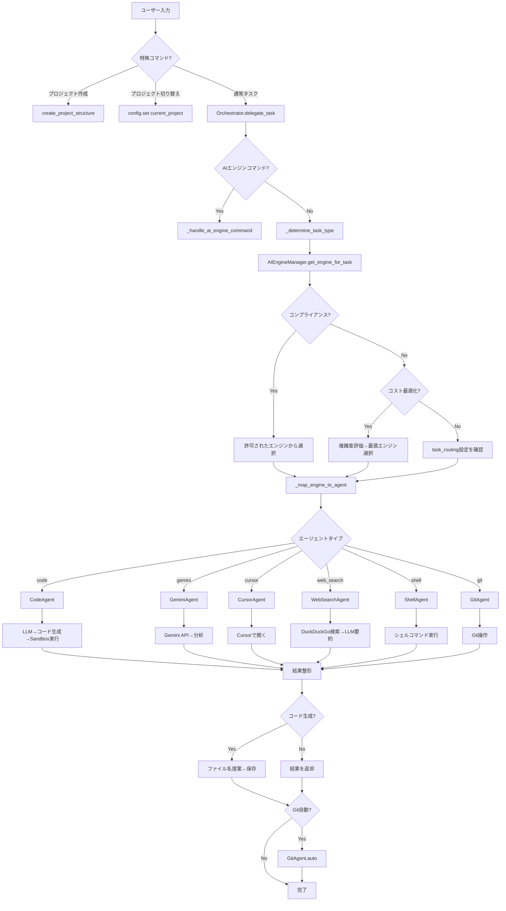

# Airis 処理フロー詳細

## バージョン情報

| 項目 | 内容 |
|------|------|
| 作成日 | 2025-10-13 |
| バージョン | 2.2.0 |
| 対象システム | Airis AI Development Assistant |

---

## 1. 概要

このドキュメントでは、Airisがユーザーからの指示を受けてから、結果を返すまでの処理フローを詳細に説明します。

---

## 2. 全体処理フロー

```
┌─────────────────────────────────────────────────────────────────┐
│                        ユーザー入力                              │
│              "generate requirements"                             │
└─────────────────────┬───────────────────────────────────────────┘
                      │
                      ▼
┌─────────────────────────────────────────────────────────────────┐
│  1. main.py - CLIエントリーポイント                              │
│     - Typerでコマンドライン引数を受け取る                        │
│     - プロジェクト作成/切り替えの特殊処理                        │
└─────────────────────┬───────────────────────────────────────────┘
                      │
                      ▼
┌─────────────────────────────────────────────────────────────────┐
│  2. Orchestrator.delegate_task()                                │
│     - ユーザープロンプトを受け取る                              │
│     - AIエンジンコマンドかチェック                              │
└─────────────────────┬───────────────────────────────────────────┘
                      │
                      ▼
┌─────────────────────────────────────────────────────────────────┐
│  3. タスクタイプの判定                                          │
│     _determine_task_type(user_prompt)                           │
│     - キーワードマッチングでタスクタイプを特定                  │
│     - 例: "generate" → document_generation                      │
│           "analyze code" → code_analysis                        │
│           "cursor" → code_generation                            │
└─────────────────────┬───────────────────────────────────────────┘
                      │
                      ▼
┌─────────────────────────────────────────────────────────────────┐
│  4. AIエンジンの選択                                            │
│     AIEngineManager.get_engine_for_task()                       │
│     ┌─────────────────────────────────────┐                     │
│     │ a. 設定の動的読み込み                │                     │
│     │    - config.yamlを再読み込み        │                     │
│     └─────────────────────────────────────┘                     │
│     ┌─────────────────────────────────────┐                     │
│     │ b. コンプライアンスモード確認        │                     │
│     │    - 有効なら許可されたエンジンのみ  │                     │
│     └─────────────────────────────────────┘                     │
│     ┌─────────────────────────────────────┐                     │
│     │ c. コスト最適化モード確認            │                     │
│     │    - タスク複雑度を評価              │                     │
│     │    - コスト設定に基づいて選択        │                     │
│     └─────────────────────────────────────┘                     │
│     ┌─────────────────────────────────────┐                     │
│     │ d. タスクルーティング確認            │                     │
│     │    - config.yamlのtask_routingを参照 │                     │
│     └─────────────────────────────────────┘                     │
│     ┌─────────────────────────────────────┐                     │
│     │ e. デフォルトエンジンにフォールバック│                     │
│     └─────────────────────────────────────┘                     │
└─────────────────────┬───────────────────────────────────────────┘
                      │
                      ▼
┌─────────────────────────────────────────────────────────────────┐
│  5. エンジンからエージェントへのマッピング                      │
│     _map_engine_to_agent()                                      │
│     - claude → llm_client (LangChain経由)                      │
│     - gemini → gemini                                           │
│     - cursor → cursor                                           │
│     - web_search → web_search                                   │
│     - web_browser → web_browser                                 │
│     - local → code/shell (タスクに応じて)                       │
└─────────────────────┬───────────────────────────────────────────┘
                      │
                      ▼
┌─────────────────────────────────────────────────────────────────┐
│  6. エージェントの実行                                          │
│     agent.execute(user_prompt)                                  │
└─────────────────────┬───────────────────────────────────────────┘
                      │
                      ▼
┌─────────────────────────────────────────────────────────────────┐
│  7. 結果の処理と返却                                            │
│     - 実行結果を整形                                            │
│     - ユーザーに表示                                            │
└─────────────────────────────────────────────────────────────────┘
```

---

## 3. 詳細処理フロー（各コンポーネント）

### 3.1 main.py - エントリーポイント

```python
def main(prompt: str):
    # 1. 特殊コマンドのチェック
    if prompt.startswith("create new project"):
        create_project_structure(project_name)
        return
    
    if prompt.startswith("use project"):
        config.set("current_project", project_name)
        return
    
    # 2. Orchestratorに委譲
    orchestrator = Orchestrator()
    display_result, generated_code = orchestrator.delegate_task(prompt)
    
    # 3. 結果の表示
    print("--- RESULT ---")
    print(display_result)
    
    # 4. コードがあればファイルに保存
    if generated_code:
        save_to_file(generated_code)
```

**フロー**:
1. ユーザー入力を受け取る
2. プロジェクト作成/切り替えの特殊処理
3. Orchestratorに委譲
4. 結果を表示
5. 必要に応じてファイル保存

---

### 3.2 Orchestrator.delegate_task() - タスク委譲

```python
def delegate_task(user_prompt: str) -> tuple[str, str | None]:
    # 1. AIエンジンコマンドのチェック
    if user_prompt.lower().startswith("ai engine"):
        return self._handle_ai_engine_command(user_prompt), None
    
    # 2. タスクタイプの判定
    task_type = self._determine_task_type(user_prompt)
    
    # 3. AIエンジンの選択
    selected_engine = ai_engine_manager.get_engine_for_task(task_type, user_prompt)
    
    # 4. エージェントへのマッピング
    agent_name = self._map_engine_to_agent(selected_engine, user_prompt)
    
    # 5. エージェントの実行
    agent = self.agents[agent_name]
    result = agent.execute(user_prompt)
    
    # 6. Git自動コミット（設定による）
    if should_auto_commit:
        git_agent.execute("git auto")
    
    return result
```

**フロー**:
1. AIエンジンコマンドかチェック
2. タスクタイプを判定
3. 最適なAIエンジンを選択
4. エンジンをエージェントにマッピング
5. エージェント実行
6. Git自動コミット（オプション）

---

### 3.3 タスクタイプの判定

```python
def _determine_task_type(user_prompt: str) -> str:
    prompt_lower = user_prompt.lower()
    
    # キーワードベースの判定
    if "generate" in prompt_lower and "requirement" in prompt_lower:
        return "document_generation"
    
    if "generate" in prompt_lower and "design" in prompt_lower:
        return "document_generation"
    
    if "cursor" in prompt_lower:
        return "code_generation"
    
    if "code" in prompt_lower or "python" in prompt_lower:
        return "code_generation"
    
    if "analyze" in prompt_lower:
        return "code_analysis"
    
    if "search" in prompt_lower or "find information" in prompt_lower:
        return "web_search"
    
    if "browse" in prompt_lower or "fetch" in prompt_lower:
        return "web_browsing"
    
    if "git" in prompt_lower:
        return "git_operations"
    
    if "shell" in prompt_lower or "command" in prompt_lower:
        return "shell_operations"
    
    # デフォルト
    return "general"
```

**判定基準**:
- キーワードマッチング
- ユーザープロンプトの内容分析
- フォールバック: "general"

---

### 3.4 AIエンジンの選択ロジック

```python
def get_engine_for_task(task_type: str, user_prompt: str) -> str:
    # 1. 設定の動的読み込み
    self._load_configuration()
    
    # 2. コンプライアンスモード優先
    if self.compliance_mode:
        return self._get_compliant_engine(task_type, user_prompt)
    
    # 3. コスト最適化モード
    if self.cost_optimization:
        return self._get_cost_optimized_engine(task_type, user_prompt)
    
    # 4. タスクルーティング設定
    if task_type in self.task_routing:
        engine = self.task_routing[task_type]
        if self._is_engine_available(engine):
            return engine
    
    # 5. デフォルトエンジン
    if self._is_engine_available(self.default_engine):
        return self.default_engine
    
    # 6. フォールバック
    return "local"
```

**選択優先順位**:
1. コンプライアンスモード（最優先）
2. コスト最適化モード
3. タスクルーティング設定
4. デフォルトエンジン
5. ローカルエンジン（フォールバック）

---

### 3.5 コスト最適化の判定

```python
def _get_cost_optimized_engine(task_type: str, user_prompt: str) -> str:
    # 1. タスク複雑度の評価
    complexity = self._assess_task_complexity(user_prompt)
    
    # 2. 複雑度に応じたエンジン選択
    if complexity == "simple":
        return self.cost_preferences.get("free", "local")
    
    elif complexity == "moderate":
        engine = self.cost_preferences.get("low_cost", "web_search")
        if self._is_engine_available(engine):
            return engine
    
    elif complexity == "complex":
        engine = self.cost_preferences.get("medium_cost", "gemini")
        if self._is_engine_available(engine):
            return engine
    
    elif complexity == "very_complex":
        engine = self.cost_preferences.get("high_cost", "claude")
        if self._is_engine_available(engine):
            return engine
    
    # 3. フォールバック
    return self.default_engine
```

**複雑度評価**:
- **simple**: 基本的な操作（list, echo, etc）
- **moderate**: 標準的なタスク（simple code, basic search）
- **complex**: 高度なタスク（advanced code, detailed analysis）
- **very_complex**: 非常に高度なタスク（architecture design, complex algorithms）

---

### 3.6 エージェント実行フロー

#### 3.6.1 Gemini Agent

```
user_prompt: "gemini analyze code: print('hello')"
    ↓
1. GeminiAgent.execute(instruction)
    ↓
2. コードの抽出
   - 正規表現でコードを抽出
   - "code:" 以降の文字列
   - クォート/バッククォート内の文字列
    ↓
3. Gemini APIの呼び出し
   - model: gemini-2.5-pro
   - 詳細な分析プロンプトを生成
    ↓
4. レスポンスの整形
   - 機能、品質、パフォーマンス、セキュリティの観点から分析
    ↓
5. 結果を返却
```

#### 3.6.2 Code Agent

```
user_prompt: "code generate: Create a calculator"
    ↓
1. CodeAgent.execute(instruction)
    ↓
2. LLMにコード生成を依頼
   - LLMClient.invoke(prompt)
   - Claude APIが実行される
    ↓
3. 生成されたコードを取得
    ↓
4. Base64エンコード
   - シェルエスケープ問題を回避
    ↓
5. Sandboxで実行
   - docker run --rm python:3.11-slim python3 -c "$(echo {base64} | base64 -d)"
    ↓
6. 実行結果とコードを返却
    ↓
7. Orchestratorでファイル名を提案
   - LLMにファイル名を尋ねる
    ↓
8. プロジェクトのsrc/に保存
   - 現在のプロジェクトのsrc/ディレクトリ
    ↓
9. Git自動コミット（オプション）
```

#### 3.6.3 Document Generation

```
user_prompt: "generate requirements"
    ↓
1. Orchestrator内で特殊処理
   - ドキュメント生成は専用ロジック
    ↓
2. プロジェクトパスの確認
   - current_project設定をチェック
   - プロジェクトがなければエラー
    ↓
3. ドキュメントタイプの判定
   - "requirements" → 01_requirements.md
   - "design" → 02_design.md
   - "readme" → README.md
    ↓
4. AIエンジンの選択
   - task_type: "document_generation"
   - 設定により選択（デフォルト: gemini）
    ↓
5. LLM/Geminiにプロンプト送信
   - 日本語で詳細なドキュメント生成を依頼
   - 重要：完全に生成するよう指示
    ↓
6. 生成されたドキュメントを保存
   - projects/{project_name}/doc/{filename}
    ↓
7. DocumentCompletionAgentで完全性チェック
   - ドキュメントが完全か確認
   - 不完全なら補完
    ↓
8. Git自動コミット（オプション）
```

#### 3.6.4 Web Search Agent

```
user_prompt: "web search: Docker best practices 2024"
    ↓
1. WebSearchAgent.execute(instruction)
    ↓
2. 検索クエリの抽出
   - "web search:" 以降の文字列
    ↓
3. DuckDuckGo検索（ddgs）
   - DDGS().text(query, max_results=10)
    ↓
4. 検索結果を取得
   - タイトル、本文、URLのリスト
    ↓
5. LLMに要約を依頼
   - 検索結果をまとめて送信
   - 簡潔な要約を生成
    ↓
6. 要約結果を返却
```

#### 3.6.5 Cursor Agent

```
user_prompt: "cursor generate: Create a fibonacci function"
    ↓
1. CursorAgent.execute(instruction)
    ↓
2. 一時ファイルの作成
   - tempfile.NamedTemporaryFile()
   - .py拡張子
    ↓
3. 指示をファイルに書き込み
   - コメントとして記述
    ↓
4. Cursorで開く（macOS）
   - subprocess: open -a Cursor {file_path}
    ↓
5. ユーザーへの案内
   - "Cursorで開いてAIを使用してください"
   - "Cmd+KでAIチャットを開く"
    ↓
6. ファイルパスを返却
```

---

## 4. 設定読み込みフロー

```
プログラム起動
    ↓
Config.__init__()
    ↓
1. config.yaml読み込み
   - yaml.safe_load()
    ↓
2. Singletonインスタンス作成
   - config = Config()
    ↓
AIEngineManager.__init__()
    ↓
3. AI Engine設定読み込み
   - default_engine
   - task_routing
   - compliance_mode
   - cost_optimization
   - allowed_engines
   - cost_preferences
    ↓
Orchestrator.__init__()
    ↓
4. 全エージェントの初期化
   - CodeAgent()
   - ShellAgent()
   - WebSearchAgent()
   - WebBrowserAgent()
   - GeminiAgent()
   - CursorAgent()
   - GitAgent()
   - DocumentCompletionAgent()
```

---

## 5. 動的設定読み込みフロー

```
タスク実行時
    ↓
AIEngineManager.get_engine_for_task()
    ↓
1. _load_configuration()
    ↓
2. config.yamlを再読み込み
   - self.config.settings = self.config._load_config()
    ↓
3. 最新の設定を取得
   - default_engine
   - task_routing
   - compliance_mode
   - cost_optimization
    ↓
4. 設定に基づいてエンジン選択
    ↓
実行
```

**メリット**:
- Dockerコンテナ再起動不要
- config.yaml変更が即座に反映
- 開発効率の向上

---

## 6. エージェント別の処理詳細

### 6.1 Code Agent

```
1. ユーザープロンプトを受け取る
    ↓
2. LLMにコード生成を依頼
   - Claude API経由
    ↓
3. 生成されたコードを取得
    ↓
4. コードをBase64エンコード
   - シェルエスケープ問題を回避
    ↓
5. Dockerサンドボックスで実行
   - 一時コンテナ: python:3.11-slim
   - python3 -c "$(echo {base64_code} | base64 -d)"
    ↓
6. 実行結果を取得
   - stdout/stderr
    ↓
7. 結果とコードを返却
   - (execution_result, generated_code)
```

### 6.2 Gemini Agent

```
1. 指示からコードを抽出
   - 正規表現: r'code:\s*(.+)'
   - クォート内: r'["\'](.+?)["\']'
   - バッククォート内: r'```(.+?)```'
    ↓
2. 分析プロンプトを作成
   - 機能、品質、パフォーマンス、セキュリティの4観点
    ↓
3. Gemini APIを呼び出し
   - model: gemini-2.5-pro
   - genai.GenerativeModel.generate_content()
    ↓
4. レスポンスを取得
   - response.text
    ↓
5. 結果を返却
```

### 6.3 Web Search Agent

```
1. 検索クエリを抽出
   - "web search:" 以降の文字列
    ↓
2. DuckDuckGo検索
   - DDGS().text(query, max_results=10)
    ↓
3. 検索結果を整形
   - タイトル、本文、URLを抽出
    ↓
4. LLMに要約依頼
   - 検索結果をまとめて送信
   - 簡潔な要約を生成
    ↓
5. 要約を返却
```

### 6.4 Git Agent

```
1. Gitコマンドを解析
   - "git status" → status
   - "git add" → add
   - "git commit" → commit
   - "git auto" → 自動ワークフロー
    ↓
2. コマンド実行
   - subprocess.run(["git", ...])
    ↓
3. 自動ワークフローの場合
   - git add -A
   - git commit -m "Auto commit: {description}"
   - git push origin main（オプション）
    ↓
4. 結果を返却
```

---

## 7. エラーハンドリングフロー

```
エージェント実行
    ↓
try:
    実行処理
    ↓
except Exception as e:
    ↓
    エラーメッセージを生成
    ↓
    ユーザーに返却
    - "エラー: {詳細}"
    ↓
    ログに記録（将来実装）
```

---

## 8. ファイル保存フロー（コード生成時）

```
コード生成完了
    ↓
1. LLMにファイル名を提案させる
   - ユーザープロンプトと生成コードから判断
   - 例: fibonacci.py, calculator.py
    ↓
2. 現在のプロジェクトを確認
   - config.get("current_project")
    ↓
3. プロジェクトがない場合
   - エラーメッセージを返却
   - "use project {name}" を促す
    ↓
4. プロジェクトがある場合
   - projects/{project_name}/src/ に保存
    ↓
5. ファイル保存
   - with open(file_path, 'w') as f:
   -     f.write(generated_code)
    ↓
6. 保存完了メッセージ
```

---

## 9. プロジェクト管理フロー

### 9.1 プロジェクト作成

```
user_prompt: "create new project my_app"
    ↓
1. main.pyで特殊処理
    ↓
2. create_project_structure(project_name)
    ↓
3. ディレクトリ構造を作成
   - projects/my_app/
   - projects/my_app/doc/
   - projects/my_app/src/
   - projects/my_app/tests/
    ↓
4. 初期ファイルを作成
   - README.md
   - doc/01_requirements.md
   - doc/02_design.md
    ↓
5. 完了メッセージ
```

### 9.2 プロジェクト切り替え

```
user_prompt: "use project my_app"
    ↓
1. main.pyで特殊処理
    ↓
2. プロジェクトの存在確認
   - projects/my_app/ が存在するか
    ↓
3. 存在する場合
   - config.set("current_project", "my_app")
    ↓
4. 存在しない場合
   - エラーメッセージ
   - "create new project" を促す
    ↓
5. 完了メッセージ
```

---

## 10. 処理フロー図（Mermaid）



---

## 11. データフロー

### 11.1 設定の流れ

```
config.yaml
    ↓
Config._load_config()
    ↓
Config.settings (dict)
    ↓
AIEngineManager._load_configuration()
    ↓
AIEngineManager属性
    - default_engine
    - task_routing
    - compliance_mode
    - cost_optimization
    ↓
タスク実行時に参照
```

### 11.2 ユーザープロンプトの流れ

```
CLI入力
    ↓
main.py (Typer)
    ↓
Orchestrator.delegate_task()
    ↓
タスクタイプ判定
    ↓
AIエンジン選択
    ↓
エージェント選択
    ↓
エージェント実行
    ↓
結果整形
    ↓
ユーザーに表示
```

---

## 12. 並行処理とエラーハンドリング

### 12.1 現在の処理モデル
- **同期処理**: すべてのタスクは順次実行
- **エラーハンドリング**: try-exceptで各エージェントレベルで処理

### 12.2 将来の拡張（Phase 3以降）
- **非同期処理**: 複数タスクの並行実行
- **タスクキュー**: 長時間タスクのバックグラウンド実行
- **リトライロジック**: API失敗時の自動リトライ

---

## 13. セキュリティフロー

### 13.1 サンドボックス実行

```
コード/コマンド生成
    ↓
一時Dockerコンテナ起動
    ↓
隔離された環境で実行
    ↓
結果を取得
    ↓
コンテナ削除（--rm）
    ↓
ホストシステムは保護される
```

### 13.2 API キー管理

```
.env ファイル
    ↓
docker-compose.yml (env_file)
    ↓
環境変数として注入
    ↓
os.environ.get("ANTHROPIC_API_KEY")
    ↓
各エージェントで使用
    ↓
.envはGitから除外（.gitignore）
```

---

## 14. パフォーマンス最適化

### 14.1 設定キャッシング
- Configクラス: Singleton パターン
- 初回読み込み後はメモリにキャッシュ
- 動的読み込み: 必要時に再読み込み

### 14.2 Dockerイメージキャッシング
- ビルド時のレイヤーキャッシュ
- requirements.txtを先にCOPY
- コードは最後にCOPY

---

## 15. まとめ

Airisの処理フローは以下の特徴があります：

1. **モジュラー設計**: 各コンポーネントが独立
2. **柔軟なルーティング**: タスクに応じた最適なAI選択
3. **動的設定**: 実行時の設定変更に対応
4. **安全性**: サンドボックス実行で保護
5. **拡張性**: 新しいエージェント/エンジンの追加が容易

このフローにより、ユーザーは自然言語で指示するだけで、複雑なタスクを自動化できます。

